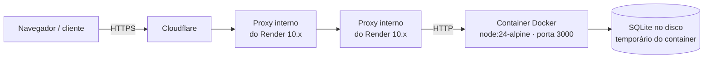
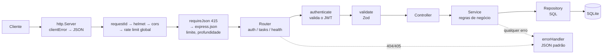

# Task API (Express) — Anotações de estudo

> **Data:** 2026-10-06 (atualizado em 2026-10-09) · **Stack:** Node.js 24 (mínimo 22.13) · Express 5 · Zod 4 ·
> JWT + bcryptjs · SQLite (`node:sqlite`) · Jest + Supertest · ESLint + Prettier · Docker · GitHub Actions · Render

---

## 1. Visão geral

API REST de **gerenciamento de tarefas** (to-do list): cada usuário cria uma conta, faz login, recebe um token JWT e
gerencia só as próprias tarefas, com filtros, busca, ordenação e paginação.

O pedido inicial foi uma API simples, mas **sem pontas soltas**: todo erro tratado e sempre com uma resposta. Por
isso o foco do projeto é o **tratamento de erros completo**: qualquer falha (campo inválido, token vencido, JSON
quebrado, rota inexistente, erro inesperado) devolve um JSON **sempre no mesmo formato**.

É a primeira de duas implementações da **mesma API**: a outra é o `task-api-flask` (Python + Flask), com os mesmos
endpoints, códigos de erro e mensagens. O repositório `task-api-compose` sobe as duas juntas e prova, com um teste de
contrato, que elas respondem igual.

**Em produção:** https://task-api-express-2pva.onrender.com (documentação em `/docs`), no plano gratuito do Render.

---

## 2. Arquitetura

É só o backend, consumido por qualquer cliente HTTP (Swagger UI, Postman...) e pelo front em Angular
(`task-app-angular`), que tem um seletor para alternar entre esta API e a versão Flask.

### Em produção (Render)



Cada salto acrescenta um IP no cabeçalho `X-Forwarded-For`. Por isso a API precisa saber quantos proxies atravessar
(`TRUST_PROXY=3`) para achar o IP real de quem fez a requisição. Veja a Fase 16.

### Caminho de uma requisição



### Camadas de cada módulo

| Camada         | Responsabilidade                                                                            | Exemplo                |
| -------------- | ------------------------------------------------------------------------------------------- | ---------------------- |
| **routes**     | Liga URL + método aos middlewares e ao controller; responde 405 para métodos não suportados | `task.routes.js`       |
| **schemas**    | Formato esperado dos dados (Zod)                                                            | `createTaskSchema`     |
| **controller** | Traduz HTTP ↔ service (status, cabeçalho `Location`, corpo da resposta)                     | `task.controller.js`   |
| **service**    | Regras de negócio (a tarefa é desse usuário?)                                               | `getOwnedTask`         |
| **repository** | Só acesso ao banco (SQL)                                                                    | `createTaskRepository` |

O service não sabe nada de HTTP e o repository não sabe nada de regras de negócio. Cada peça é criada por uma
função (`createTaskService({ taskRepository })`) que recebe as dependências por parâmetro.

### Estrutura de pastas

```
src/
├── server.js            # sobe o HTTP, trata sinais (SIGINT/SIGTERM) e erros de processo
├── app.js               # createApp({ db, config }): monta middlewares e rotas
├── config/env.js        # lê e valida as variáveis de ambiente com Zod
├── config/cors.js       # interpreta o CORS_ORIGIN (lista de origens, com curinga)
├── db/database.js       # conexão node:sqlite + criação das tabelas
├── docs/openapi.js      # especificação OpenAPI 3
├── errors/AppError.js   # erro padrão da aplicação + atalhos (notFound, conflict...)
├── lib/                 # logger JSON, Zod em português, limite de aninhamento do JSON
├── middlewares/         # requestId, log de acesso, requireJson, validate, authenticate, 404/405, rate limit, errorHandler
└── modules/
    ├── auth/            # cadastro, login, /me
    ├── tasks/           # CRUD de tarefas
    ├── users/           # acesso à tabela de usuários
    └── health/          # /health
tests/                   # 136 testes (auth, tasks, erros/infra, CORS)
.github/                 # CI (workflows/ci.yml) e Dependabot (dependabot.yml)
Dockerfile, docker-compose.yml, .dockerignore
eslint.config.js, .prettierrc.json, .gitattributes
```

---

## 3. Fases e etapas

### Fase 1 — Escolha do projeto e base

- **Objetivo:** uma API pequena, mas que passe por quase todo tipo de erro HTTP.
- **O que foi feito:** a ideia de uma API de tarefas com usuários e autenticação foi escolhida porque cobre 400, 401,
  403, 404, 405, 409, 413, 415, 429 e 500. Antes de escrever código, foi definida a tabela de erros e o formato da
  resposta de erro. `package.json` em CommonJS e `createApp({ db, config })` recebendo banco e configuração por
  parâmetro.
- **Por quê:** definir o contrato de erros primeiro serviu de "especificação" para as duas versões (Express e Flask).
  A injeção de `db` e `config` permite que cada teste crie um app isolado com banco em memória.

### Fase 2 — Configuração validada (`config/env.js`)

- **O que foi feito:** as variáveis de ambiente passam por um schema Zod. `JWT_SECRET` é obrigatório e precisa de
  32+ caracteres. Se algo estiver errado, o processo nem sobe e lista o problema.
- **Por quê:** é melhor falhar na subida do que descobrir em produção que o segredo estava vazio.

### Fase 3 — Banco com `node:sqlite`

- **O que foi feito:** tabelas `users` e `tasks` com `FOREIGN KEY ... ON DELETE CASCADE`, `CHECK` em `status` e
  `priority`, índice em `tasks.user_id`, `PRAGMA foreign_keys = ON` e modo WAL.
- **Por quê:** o Node 22.13+ traz o SQLite embutido (`node:sqlite`). Isso evita bibliotecas nativas como o
  `better-sqlite3`, que precisam ser compiladas e costumam dar trabalho no Windows. Antes de decidir, foi testado
  que, no Node 24, o módulo funciona sem nenhum aviso de "experimental".

### Fase 4 — Tratamento de erros (o coração do projeto)

- **Objetivo:** toda resposta de erro no formato `{ "error": { status, code, message, details, requestId } }`.
- **O que foi feito:**
  1. `AppError` com status, código, mensagem, `details` (sempre array) e cabeçalhos extras (`Allow`,
     `WWW-Authenticate`, `Retry-After`).
  2. `errorHandler` com `normalizeError()`, que converte **qualquer coisa** lançada (até uma string ou `null`) em
     `AppError`. Erros do `express.json()` são reconhecidos pelo `err.type` (`entity.parse.failed` → 400,
     `entity.too.large` → 413, `charset.unsupported` → 415...).
  3. Erros 500 vão para o log com o stack trace. O cliente recebe só "Erro interno do servidor" (o campo `debug`
     aparece apenas com `NODE_ENV=development`).
  4. Se a resposta já começou a ser enviada (`res.headersSent`), não dá para trocar o status: a conexão é encerrada.
  5. `notFound` (404 `ROUTE_NOT_FOUND`) e `allowMethods(...)` (405 com cabeçalho `Allow`).
  6. `requestId`: reaproveita o `X-Request-Id` do cliente se ele for seguro (letras, números, `-`, `_`), senão gera
     um UUID.
- **Por quê:** o **Express 5** já encaminha para o error handler os erros de funções `async`; no Express 4 era
  preciso um `try/catch` ou um wrapper em cada rota. O `code` é estável e serve para o programa cliente decidir; a
  `message` é para humanos.

### Fase 5 — Corpo da requisição e validação

- **O que foi feito:**
  - `requireJson` devolve **415** se um POST/PUT/PATCH tem corpo e não é `application/json`. Ele roda **antes** do
    `express.json()`, que simplesmente ignoraria um corpo de outro tipo.
  - `express.json({ limit })` → 413 acima do limite.
  - `validate({ params, query, body })` valida tudo junto e devolve **todos** os problemas em `details`.
  - Zod 4 com mensagens em português (`z.config(z.locales.pt())`) e mensagens próprias por campo.
  - `z.strictObject` rejeita campos desconhecidos ("Campo não permitido").
- **Detalhe:** quando o tipo do campo está errado (ex.: `password: ["x"]`), o Zod 4 continua rodando as outras
  regras e devolvia também "Senha deve ter pelo menos 8 caracteres". O `validate` passou a manter só o erro de tipo.

### Fase 6 — Autenticação (JWT + bcryptjs)

- **O que foi feito:** `/auth/register`, `/auth/login` e `/auth/me`. Senha guardada com bcrypt. JWT HS256 com `sub`
  (id do usuário), `iss` (emissor) e `exp`.
- **Decisões de segurança:**
  - **Mesma resposta e mesmo tempo** para "e-mail não existe" e "senha errada": quando o e-mail não existe, o login
    compara com um _hash fictício_, para o tempo de resposta não revelar quais e-mails têm conta.
  - **Limite de 72 bytes** na senha (não 72 caracteres): o bcrypt só usa 72 bytes, e um acento ocupa 2 bytes em
    UTF-8. O `bcryptjs` cortaria o resto em silêncio. No login, uma senha maior que o limite é recusada.
  - Algoritmo fixo na validação (`algorithms: ['HS256']`), o que bloqueia tokens com `alg: none`.
  - **`iss: 'task-api-express'`**: veja a seção 7. Sem isso, um token emitido pelo Flask autenticava aqui outra
    pessoa.

### Fase 7 — CRUD de tarefas

- `GET /tasks` com filtros, busca, paginação (`data` + `meta`) e ordenação.
- `POST` → **201** + cabeçalho `Location`; `PATCH` parcial (exige ao menos um campo); `DELETE` → **204**.
- **404** se a tarefa não existe, **403** se é de outro usuário.
- SQL só com parâmetros (`?`). O `ORDER BY` vem de uma lista fechada (`ORDER_BY`), e `%`/`_` da busca são escapados.
- **A autenticação fica em cada rota, e não num `router.use`**, para que 404 e 405 sejam respondidos antes de exigir
  token. No começo, `PUT /tasks` sem token devolvia 401, quando o correto é 405 (o método não existe para ninguém).

### Fase 8 — Segurança HTTP e documentação

- `helmet` (cabeçalhos de segurança), `cors` (expondo `X-Request-Id` e `Location`) e `express-rate-limit` (global e
  um limite menor para `/auth/register` e `/auth/login`), com resposta 429 no formato padrão.
- OpenAPI 3 em `/openapi.json` e Swagger UI 5 em `/docs`, que já tem tema escuro.

### Fase 9 — Servidor e processo (`server.js`)

- `http.createServer(app)`, para tratar os eventos do servidor diretamente.
- `clientError`: uma requisição HTTP malformada, que nem chega ao Express, também recebe JSON no formato padrão.
- Porta ocupada ou sem permissão: mensagem clara e saída com código 1.
- SIGINT/SIGTERM: para de aceitar conexões, fecha o banco e força a saída após 10 s.
- `unhandledRejection` e `uncaughtException` são logados e encerram o processo de forma controlada.

### Fase 10 — Testes (Jest + Supertest)

- 115 testes nesta fase (hoje são 136, com os de CORS e de proxy): auth, tarefas e erros/infraestrutura. O
  Supertest faz requisições HTTP ao app sem abrir uma porta.
- `buildApp()` cria um app com banco em memória para cada teste. `BCRYPT_ROUNDS=4` deixa a suíte rápida.
- `expectError()` confere que todo erro segue exatamente o formato padrão.

### Fase 11 — Docker

- `Dockerfile` em duas etapas: a primeira instala só as dependências de produção (`npm ci --omit=dev`), e a imagem
  final (`node:24-alpine`) leva só `node_modules` e `src`.
- Roda com o usuário `node` (sem privilégios), tem `HEALTHCHECK` em `/health` e guarda o banco no volume
  `express-data`.
- `docker-compose.yml` exige o `JWT_SECRET` (`${JWT_SECRET:?...}`) e usa `init: true` e `stop_grace_period: 15s`.

### Fase 12 — CI no GitHub Actions

- Job **Testes** na matriz Node 22 (mínimo suportado) e Node 24 (o do Docker).
- Job **Imagem Docker**: build, sobe o container, espera o health check, testa um erro no formato padrão e confere
  que o `docker stop` termina com código 0.
- `concurrency` cancela a execução anterior quando chega um push novo na mesma branch.

### Fase 13 — Limite de aninhamento do JSON

- `lib/jsonDepth.js` recusa JSON com mais de **32 níveis** de `[`/`{` (fora de strings), usando a opção `verify` do
  `express.json()`, que roda sobre os bytes **antes** do `JSON.parse`.
- **Por quê:** o Node aceita dezenas de milhares de níveis, enquanto o Python dependia da pilha do sistema. Com um
  limite explícito, as duas APIs respondem igual em qualquer sistema operacional.

### Fase 14 — Dependabot e proteção da `main`

- **Dependabot** (`.github/dependabot.yml`) para npm, GitHub Actions e a imagem Docker. Roda toda segunda, agrupa
  minor/patch num PR, espera 3 dias (7 para major) depois de uma versão sair e ignora major do Node (24 → 26 é uma
  decisão manual).
- **Ruleset na `main`**: proíbe apagar a branch e force push, exige PR (com 0 aprovações, porque o GitHub não deixa
  aprovar o próprio PR) e exige os checks `Testes (Node 22)`, `Testes (Node 24)`, `Imagem Docker` e `Lint`.

### Fase 15 — Lint e formatação

- **ESLint 10** (flat config em `eslint.config.js`) com as regras recomendadas e algumas a mais (`eqeqeq`,
  `prefer-const`...). **Prettier 3** para formatação (aspas simples, vírgula no final, 120 colunas).
- `eslint-config-prettier` desliga as regras de estilo do ESLint que brigariam com o Prettier.
- Job **Lint** no CI: ESLint, `prettier --check` e **actionlint** (verifica os workflows).
- `.gitattributes` com `eol=lf`: veja a seção 7.

### Fase 16 — Deploy no Render

- **Objetivo:** colocar a API no ar de graça, usando o mesmo `Dockerfile` testado no computador e no CI.
- **Escolha da hospedagem:** o Render foi escolhido por ser o único gratuito, sem cartão, que roda as duas APIs a
  partir do Dockerfile e integra o deploy ao CI. Alternativas descartadas: Koyeb (só 1 serviço grátis), Google Cloud
  Run e Oracle Cloud (exigem cartão; a Oracle ainda exige administrar um servidor), Fly.io e Railway (sem plano
  gratuito contínuo).
- **Como o Docker vai para produção:** com `runtime: docker`, a cada deploy o Render baixa o repositório, roda o
  `Dockerfile`, guarda a imagem e sobe um container com ela. A imagem de produção sai da mesma receita testada no CI.
- **O que foi feito:**
  1. **`TRUST_PROXY`** (variável nova, padrão 0): `app.set('trust proxy', N)` diz ao Express quantos proxies
     atravessar no `X-Forwarded-For` para achar o IP real do cliente, que o rate limit usa.
  2. **Log de acesso** (`middlewares/accessLog.js`): uma linha JSON por requisição, com método, rota, status, tempo,
     IP e `requestId`. O `/health` com sucesso fica de fora, porque o Render o chama a cada poucos segundos.
  3. **Blueprint** (`render.yaml` no repositório `task-api-compose`): define as duas APIs como código. Plano `free`,
     região `virginia` (não há região na América do Sul), `healthCheckPath: /health`, `PORT=3000` (igual ao
     Dockerfile), um `JWT_SECRET` gerado pelo Render e `autoDeployTrigger: checksPass`, que só faz o deploy depois
     que o CI passa.
- **Medindo o `TRUST_PROXY`:** o Render não documenta quantos proxies existem. O valor foi descoberto na prática,
  com requisições marcadas pelo `X-Request-Id` e um `X-Forwarded-For` forjado:
  - com `1`, o log mostrava IPs internos `10.x` que **mudavam a cada requisição**, então o rate limit tratava todos
    os visitantes como poucos "clientes";
  - com `3` (Cloudflare + dois proxies internos), o log mostrou o IP real e ignorou o IP forjado.
  - Atalho para conferir sem os logs: o cabeçalho `RateLimit` (`r=` requisições restantes) deve cair de 1 em 1 em
    requisições seguidas, mesmo com IPs forjados.
- **Limitações do plano free:** dorme após 15 min sem acesso e leva de 15 a 60 s para acordar; o disco é
  temporário, então o SQLite começa vazio a cada deploy, reinício ou soneca. Para uma demonstração de portfólio,
  isso foi considerado aceitável.

### Fase 17 — CORS com lista de origens

- **Objetivo:** liberar o front publicado (e as URLs de preview dele) sem abrir a API para qualquer site.
- **O que foi feito:** `CORS_ORIGIN` continua aceitando `*`, mas agora também uma **lista separada por vírgula**,
  em que cada item pode ter `*` no nome do host (ex.: `https://meu-front-*-minha-conta.vercel.app`). Fica em
  `config/cors.js`, com testes próprios (`tests/cors.test.js`).
- **Detalhes de segurança:** o `*` só casa letras, números e hífens, **nunca um ponto**. Assim,
  `https://app-*.vercel.app` não aceita `https://app-x.site-de-outra-pessoa.vercel.app`. Um valor inválido impede a
  API de subir, com o motivo de cada item.
- Essa mudança foi feita fora desta conversa, provavelmente durante o trabalho no front. A descrição vem do commit
  `7b70c72` e do código.

### Fase 18 — Cabeçalhos de rate limit expostos e padronizados

- **O que foi feito:** `RateLimit`, `RateLimit-Policy` e `Retry-After` entraram no `Access-Control-Expose-Headers`.
  Sem isso, o JavaScript do navegador não consegue lê-los numa resposta de outra origem, e o front não poderia
  mostrar quantas requisições restam.
- O nome da política passou a ser em segundos (`"100-in-900sec"`), igual ao da versão Flask. O padrão do
  `express-rate-limit` era `"100-in-15min"`, e essa diferença aparecia nos testes feitos depois do deploy.
- Quando uma requisição passa por dois limites (global e autenticação), os dois aparecem no cabeçalho.
- Também feita fora desta conversa (commit `91c2920`).

---

## 4. Ferramentas e tecnologias

| Ferramenta             | Para que serve (em geral)             | Como foi usada aqui                         | Por que foi escolhida                                              |
| ---------------------- | ------------------------------------- | ------------------------------------------- | ------------------------------------------------------------------ |
| **Node.js 24**         | Rodar JavaScript no servidor          | Toda a aplicação                            | LTS atual; traz `node:sqlite` e `fetch` embutidos                  |
| **Express 5**          | Framework web minimalista             | Rotas, middlewares, error handler           | Padrão de mercado; a v5 trata erros de funções `async` sozinha     |
| **Zod 4**              | Validação de dados com schemas        | Body, query, params e variáveis de ambiente | Mensagens em português embutidas (`z.locales.pt`)                  |
| **jsonwebtoken**       | Gerar e validar JWT                   | Login e `authenticate`                      | Biblioteca mais usada para JWT em Node                             |
| **bcryptjs**           | Hash de senha                         | Cadastro e login                            | Implementação em JavaScript puro, sem compilação nativa            |
| **node:sqlite**        | SQLite embutido no Node               | Usuários e tarefas                          | Sem dependência nativa nem servidor de banco                       |
| **helmet**             | Cabeçalhos de segurança HTTP          | Todas as respostas                          | Um middleware cobre CSP, HSTS, nosniff...                          |
| **cors**               | Liberar acesso de outros domínios     | Configurável por `CORS_ORIGIN`              | Padrão do ecossistema Express                                      |
| **express-rate-limit** | Limitar requisições por IP            | Global e para autenticação                  | Cabeçalhos `RateLimit` no padrão do IETF                           |
| **swagger-ui-express** | Documentação interativa               | `/docs`                                     | Testar a API pelo navegador                                        |
| **Jest + Supertest**   | Testes e requisições HTTP de teste    | 136 testes                                  | Jest é o padrão em Node; o Supertest dispensa subir o servidor     |
| **ESLint + Prettier**  | Lint (erros) e formatação (estilo)    | `npm run lint` e `npm run format:check`     | Um aponta bugs prováveis, o outro padroniza o estilo sem discussão |
| **Docker / Compose**   | Empacotar e rodar em containers       | Imagem da API + volume do banco             | Roda igual em qualquer máquina                                     |
| **GitHub Actions**     | CI: rodar verificações a cada push/PR | Lint, testes em 2 versões, imagem Docker    | Integrado ao GitHub, gratuito para repositório público             |
| **Dependabot**         | PRs automáticos de atualização        | npm, actions e imagem Docker                | Mantém as dependências em dia com o CI validando                   |
| **actionlint**         | Verificar workflows do GitHub Actions | Job Lint                                    | Pega erro de sintaxe e de shell antes do push                      |
| **Render**             | Hospedagem de aplicações (PaaS)       | Roda o container a partir do Dockerfile     | Gratuito sem cartão, usa o Dockerfile e espera o CI passar         |

### Explicando as principais

- **Middleware (Express):** uma função `(req, res, next)` que roda no caminho da requisição. Ela pode responder,
  alterar `req` ou chamar `next()` para passar adiante. Chamar `next(erro)` pula direto para o error handler, que é
  reconhecido por ter **4 parâmetros** `(err, req, res, next)`. Por isso o parâmetro não usado se chama `_next`: ele
  precisa existir, e o `_` avisa o ESLint que é de propósito.
- **Zod:** você descreve o formato (`z.string().min(1).max(120)`) e o `safeParse` devolve os dados convertidos ou a
  lista de problemas (`issues`).
- **JWT:** token assinado (não criptografado) com cabeçalho, payload e assinatura. O servidor não guarda sessão: ele
  confere a assinatura com o `JWT_SECRET`. `sub` diz quem é o usuário, `exp` quando expira e `iss` quem emitiu.
- **Jest + Supertest:** `request(app).post('/tasks').send({...})` faz uma requisição de verdade ao app em memória, e
  `expect(...)` confere o resultado.
- **ESLint × Prettier:** o ESLint procura _erros_ (variável não usada, `==` em vez de `===`). O Prettier só cuida da
  _aparência_ (espaços, quebras de linha). Usar os dois juntos exige desligar as regras de estilo do ESLint.
- **Render:** uma plataforma onde você não administra servidor. Você aponta o repositório, e ela constrói e roda a
  aplicação. O **Blueprint** (`render.yaml`) descreve os serviços como código, versionado no Git, em vez de
  configurá-los clicando no painel. Uma mudança feita só no painel é sobrescrita na próxima sincronização.

---

## 5. Comandos usados

```bash
# Instala as dependências exatamente como estão no package-lock.json
npm install

# Cria a configuração a partir do exemplo (depois edite o JWT_SECRET)
cp .env.example .env

# Gera um JWT_SECRET aleatório e seguro (atenção às aspas: o comando inteiro fica entre aspas duplas)
node -p "require('crypto').randomBytes(48).toString('hex')"

# Sobe a API reiniciando ao salvar (node --watch)
npm run dev

# Sobe a API sem reload
npm start

# Testes / testes com cobertura
npm test
npm run test:coverage

# Lint e formatação
npm run lint
npm run format          # formata
npm run format:check    # só verifica (é o que o CI roda)

# Sobe a API em container (lê o JWT_SECRET do .env)
docker compose up --build -d

# Fluxo de trabalho com a main protegida
git switch -c feat/minha-mudanca
git push -u origin feat/minha-mudanca   # depois: abrir PR, esperar o CI, fazer o merge
```

Endereços: API em http://localhost:3000, documentação em http://localhost:3000/docs. Em produção:
https://task-api-express-2pva.onrender.com.

```bash
# Conferir o TRUST_PROXY em produção: o "r=" do RateLimit deve cair de 1 em 1, mesmo com IP forjado
for ip in "" 1.2.3.4 5.6.7.8; do
  curl -s -D - -o /dev/null ${ip:+-H "X-Forwarded-For: $ip"} https://task-api-express-2pva.onrender.com/tasks \
    | grep -i '^ratelimit:'
done

# Requisição marcada para achar no log do Render (a API reaproveita o X-Request-Id)
curl -H "X-Request-Id: sonda-1" https://task-api-express-2pva.onrender.com/tasks

# Seu IP público (IPv4), para comparar com o campo "ip" do log
curl -4 https://ifconfig.me
```

O deploy acontece sozinho: merge na `main` → CI verde → o Render constrói a imagem e sobe a nova versão.

---

## 6. Conceitos-chave

- **API REST e status HTTP:** recursos em URLs (`/tasks/1`) e verbos (`GET`, `POST`, `PATCH`, `DELETE`). 2xx deu
  certo, 4xx o cliente errou, 5xx o servidor errou.
- **401 × 403:** 401 é "não sei quem você é"; 403 é "sei quem você é, mas isso não é seu".
- **404/405 antes de 401:** se a rota ou o método não existem para ninguém, não faz sentido pedir login primeiro.
- **Contrato de API:** o acordo sobre o formato das requisições e respostas, incluindo os erros. É o que permite ter
  duas implementações (Express e Flask) intercambiáveis.
- **Injeção de dependência:** cada peça recebe o que usa por parâmetro, o que facilita trocar e testar.
- **Ataque de tempo (timing attack):** descobrir informação medindo o tempo de resposta. Por isso o login sempre roda
  o bcrypt.
- **Claim `iss` (issuer):** campo do JWT que diz quem emitiu o token. Conferi-lo impede que um token de outro sistema
  seja aceito, mesmo com o mesmo segredo.
- **Graceful shutdown:** ao receber SIGTERM, terminar as requisições em andamento e fechar o banco antes de sair.
- **Multi-stage build:** um Dockerfile com etapas; a imagem final leva só o necessário para rodar.
- **CI (Integração Contínua):** verificações automáticas a cada push/PR. Com a `main` protegida, nada entra sem
  passar por elas.
- **Matriz de versões:** rodar os mesmos testes em várias versões (Node 22 e 24) para garantir a versão mínima
  declarada no `engines`.
- **Cooldown do Dependabot:** esperar alguns dias antes de propor uma versão recém-lançada. Versões com defeito ou
  comprometidas costumam ser retiradas nesse intervalo.
- **Proxy reverso e `X-Forwarded-For`:** em produção, a requisição passa por intermediários antes de chegar à API, e
  cada um acrescenta o IP de quem o chamou no cabeçalho. O cliente também pode mandar esse cabeçalho preenchido com
  o que quiser, então só os últimos N IPs (os adicionados pelos proxies de confiança) são confiáveis.
- **Cold start:** o tempo para acordar um serviço que estava parado. No plano free do Render, de 15 a 60 s.
- **Disco efêmero (temporário):** tudo que o container grava some quando ele é recriado. Dados que precisam durar
  ficam num disco persistente ou num banco gerenciado.
- **Infraestrutura como código:** descrever a hospedagem num arquivo versionado (`render.yaml`), revisado por PR
  como qualquer código.
- **Cabeçalhos expostos no CORS:** numa resposta de outra origem, o navegador só deixa o JavaScript ler alguns
  cabeçalhos básicos. Os outros (`X-Request-Id`, `RateLimit`...) precisam estar listados no
  `Access-Control-Expose-Headers`.

---

## 7. Problemas encontrados e soluções

| Problema                                                         | Causa                                                                                                                   | Solução                                                                                      |
| ---------------------------------------------------------------- | ----------------------------------------------------------------------------------------------------------------------- | -------------------------------------------------------------------------------------------- |
| Erro de tipo e erro de tamanho juntos para o mesmo campo         | O Zod 4 continua as checagens depois de um tipo errado                                                                  | O `validate` mantém só o erro de tipo daquele campo                                          |
| Senha com acentos truncada em silêncio                           | O bcrypt usa 72 **bytes**, e o `bcryptjs` corta o resto sem avisar                                                      | Validar o limite em bytes (`Buffer.byteLength`) e recusar senha maior no login               |
| `PUT /tasks` sem token devolvia 401                              | A autenticação estava em `router.use`, que roda antes de saber se o método existe                                       | Autenticação por rota: agora devolve 405                                                     |
| HTTP malformado sem `requestId`                                  | A resposta do `clientError` foi montada à mão                                                                           | Incluir um `randomUUID()` também nela                                                        |
| Comando para gerar o `JWT_SECRET` não funcionava                 | Faltava a aspa dupla de fechamento no comando digitado                                                                  | Comando completo com as aspas; o `.env` foi criado com um segredo gerado                     |
| **Token do Flask autenticava outra pessoa aqui**                 | As duas APIs compartilhavam o `JWT_SECRET`, mas cada uma tem o seu banco: o `id = 1` é uma pessoa diferente em cada uma | Claim `iss` no token e conferência na validação; o token da outra API passa a dar 401        |
| Mensagem diferente do Flask para corpo em array                  | O Express usava a mensagem genérica do Zod                                                                              | Mensagem própria "Corpo da requisição deve ser um objeto JSON" (pega pelo teste de contrato) |
| JSON com 50 mil níveis aceito aqui e recusado no Flask (Windows) | O `JSON.parse` do Node não tem limite prático; o Python dependia da pilha                                               | Limite explícito de 32 níveis, checado nos bytes antes do parse                              |
| `prettier --check` passaria no CI e falharia no Windows          | O Git no Windows converte LF → CRLF ao baixar os arquivos                                                               | `.gitattributes` com `* text=auto eol=lf`                                                    |
| ESLint: `next` não usado no error handler                        | O Express exige os 4 parâmetros, mesmo sem usar o último                                                                | Renomear para `_next` (`argsIgnorePattern: '^_'`)                                            |
| Porta 3000 ocupada ao testar o Docker                            | O `npm run dev` estava rodando                                                                                          | Testes do Docker em outras portas (`EXPRESS_PORT=3100`)                                      |
| `req.path` mostrava `/` no log de rotas como `/tasks`            | Dentro de um router montado, o Express tira o prefixo do caminho                                                        | Usar o `req.originalUrl` sem a query string                                                  |
| O Render só listava repositórios de outras pessoas               | A conta do Render estava ligada a duas contas antigas do GitHub (de um bootcamp)                                        | Conectar a conta `EduardoLovo` com acesso só aos três repositórios                           |
| Blueprint: "render.yaml not found"                               | O repositório escolhido foi o `task-api-flask`, e não o `task-api-compose`                                              | Conectar o repositório certo                                                                 |
| Rate limit tratava todos os visitantes como poucos clientes      | `TRUST_PROXY=1`: a API via o IP de proxies internos do Render (`10.x`), e não o do cliente                              | Medir com requisições marcadas e fixar `TRUST_PROXY=3` no `render.yaml`                      |
| Nome da política diferente do Flask (`15min` × `900sec`)         | O `express-rate-limit` arredonda o nome para a maior unidade inteira                                                    | Opção `identifier` com o nome em segundos                                                    |

---

## 8. O que aprendi

- Organizar uma API Express em módulos e camadas, com dependências injetadas.
- Tratar **todos** os erros num formato único, inclusive os que não passam pelas rotas (body-parser, HTTP malformado,
  porta ocupada, exceções do processo).
- Validar com Zod e devolver todos os problemas de uma vez, em português.
- Cuidados reais de segurança: ataque de tempo, limite do bcrypt em bytes, `alg: none`, claim `iss`, SQL com
  parâmetros, rate limit.
- Que "compatível" entre sistemas pode ser uma falha de segurança: tokens compartilhados exigem usuários
  compartilhados.
- Testar com Jest + Supertest e usar a matriz de versões do CI para validar a versão mínima.
- Empacotar com Docker multi-stage, usuário sem privilégios e health check.
- Montar um fluxo profissional: CI, `main` protegida, PRs, Dependabot, lint e formatação automáticos.
- Diferenças entre Windows e Linux que aparecem na prática (quebras de linha, comportamento de bibliotecas).
- Fazer deploy de um container: como a imagem testada no CI vira o serviço em produção, e as limitações reais de um
  plano gratuito (soneca, disco temporário, cota de horas).
- Que um valor não documentado (quantos proxies existem) se descobre medindo, com requisições marcadas e logs, e
  não chutando: chutar alto deixaria o cliente forjar o IP; chutar baixo junta todos os visitantes num balde só.
- Configurar CORS com segurança para várias origens, inclusive URLs de preview.

---

## 9. Próximos passos / para estudar mais

**Melhorias possíveis**

- Cobertura mínima de testes no CI (`coverageThreshold` do Jest).
- Trocar o `CORS_ORIGIN` de `*` para o domínio do front quando ele estiver publicado.
- Trocar o SQLite por PostgreSQL, com migrations, para os dados sobreviverem aos reinícios (exige um plano pago ou
  um banco gerenciado: o Postgres gratuito do Render expira em 30 dias).
- Rate limit compartilhado entre instâncias (Redis), já que hoje ele fica na memória de cada processo.
- Refresh token e logout.
- Frontend em Angular consumindo as duas APIs (em andamento: `task-app-angular`).

**Documentação oficial**

- Express 5: https://expressjs.com/
- Zod: https://zod.dev/
- Node.js `node:sqlite`: https://nodejs.org/api/sqlite.html
- Jest: https://jestjs.io/ · Supertest: https://github.com/ladjs/supertest
- ESLint: https://eslint.org/ · Prettier: https://prettier.io/
- GitHub Actions: https://docs.github.com/actions
- Dependabot: https://docs.github.com/code-security/dependabot
- Render (Docker): https://render.com/docs/docker · Blueprint: https://render.com/docs/blueprint-spec
- Express atrás de proxies (`trust proxy`): https://expressjs.com/en/guide/behind-proxies.html
- CORS (MDN): https://developer.mozilla.org/pt-BR/docs/Web/HTTP/Guides/CORS
- OWASP API Security: https://owasp.org/API-Security/
